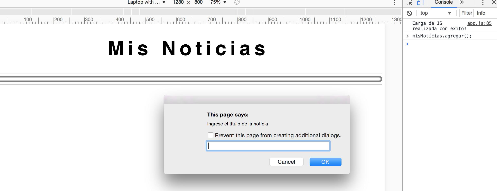

# Mostrar Noticias

Pequeña aplicacion que utiliza Vanilla JS para manipular objetos del DOM.

## Instrucciones

Para correr el programa debemos:

- abrir `index.html` en un navegador web
- Abrir al consola del navegador (Developer tools)

### Cargar noticias

1. tipear `misNoticias.agregar()`, aregar un titulo y luego un parrafo

2. Para agregar mas noticias repetimos el paso `1`.

### Mostrar noticias

1. tipear `misNoticias.mostrar()`

